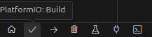
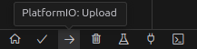
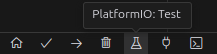

# Contributing

## Natural Workflow

- Set up development enviroment.
- Pull updates
  ```sh
  git pull
  ```
- Checkout new branch.
  - for new branches:
    ```sh
    git checkout -b <branch_name> # for new branhces
    ```
    or
    ```sh
    git branch <branch_name>
    git checkout <branch_name>
    ```
  - for existing branches:
    ```sh
    git checkout <branch_name>
    ```
- Program
- Compile and deploy code
  ```sh
  pio run # Compiles
  pio run -t upload # Deploys
  ```
  or use the GUI:

  
  
- Run Tests
  ```sh
  pio test
  ```
  or use the GUI:

  
- Finally push changes to repository
  ```sh
  git add -A
  git commit -m "<commit_type>(<package>): <description>"
  git push # git push -u origin <branch_name> if it is a new branch
  ```
  Note that the commit message should more or less follow the [Conventional Commits norms](https://www.conventionalcommits.org/en/v1.0.0-beta.4/)
- Create a Pull Request to the main branch, assigning yourself and selecting reviewers
- Verify successful workflows

## Notes on compilation, testing and platformio

When you perform any pio actions, you are performing them on all default environments. If you want to run tests on a specific environment:
```sh
pio test --environment [environment_name]
```

or compile and deploy...
```sh
pio run -t upload --environment [environment_name]
```
