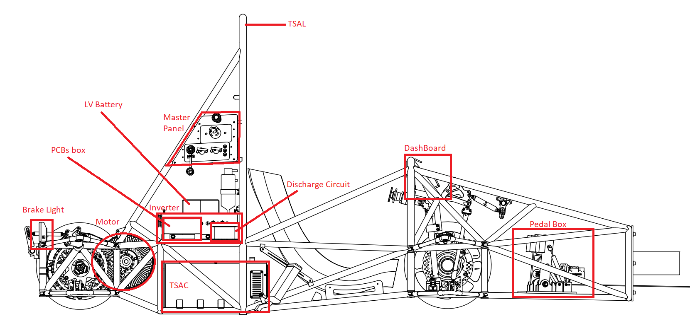
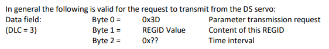
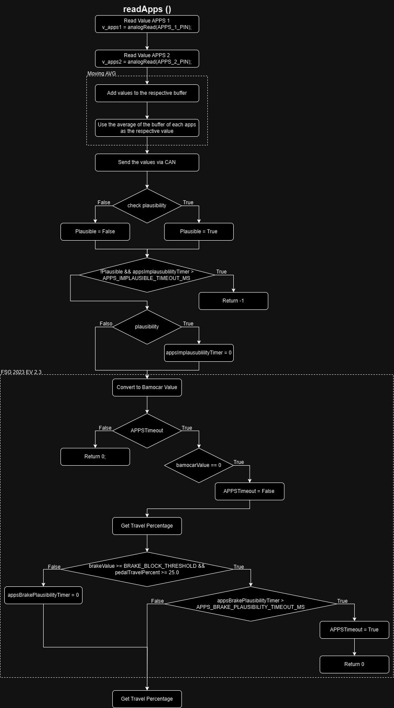
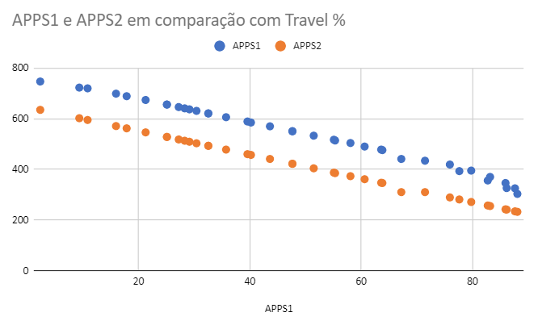
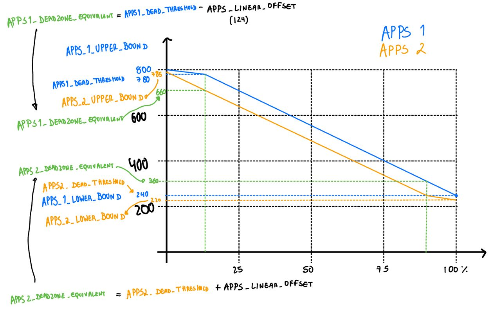

# TEENSYC3



## Initial notes:  
TeensyC1 - Caixa 1 - Located inside PCBs box

TeensyC3 - Caixa 3 - Located behind DashBoard

BMS - Battery Management System - Inside TSAC

Bamocar - Inverter/Controller

APPS - Accelerator Pedal Position Sensor - Pedal Box

BL - Brake Light


### TeensyC3 Functionalities:

- APPS (Reading and check plausibility)
- R2D (Logic + sound)
- Display
- Communication with Bamocar

## Main loop

Inputs:

- APPS 1 (APPS_1_PIN, 41)
- APPS 2 (APPS_2_PIN, 40)
- R2D Button (R2D_PIN, 32) -> uses [Bounce2 Lib](https://github.com/thomasfredericks/Bounce2)

Outputs:

- Buzzer (buzzerPin, 4)


## Button Lib

[Documentation](https://github.com/thomasfredericks/Bounce2) -> The mechanical part of buttons and switches vibrate slightly when closed or opened causing multiple undesired false states (similar to noise). This library filters out these undesired state changes.

In this case, we only use the function fell() that returns true if the pin signal transitions from high to low since the last update.

## TSOn

TS means Tractive System. If TS is on, it is because the shutdown system is closed (everything has no errors and the pilot requests to turn on the TS).  
C3 Teensy knows that TS is on because Bamocar has one register that saves the DC voltage and if DC Voltage > 0, that is because the TS is on.

## CANSniffer

This teensy also has a FIFO Filter

only accepts messages from:

- C1_ID (with Brake sensor value)
- R2D_ID (this is just for debugging and override R2D logic aka setting R2D status to Driving)
- BMS_ID (I think that this is not used)
- BAMO_RESPONSE_ID (all messages from bamocar)

## R2D Logic

### R2D Rules:  

**EV4.11.6**

The vehicle is in Ready-to-drive (R2D) mode as soon as the motor(s) will respond to the input of the APPS.

**EV4.11.7**

After the TS has been activated, additional actions must be required by the driver to set the vehicle to R2D mode, e.g. pressing a dedicated start button. The transition to R2D mode must only be possible during the actuation of the mechanical brakes and a simultaneous dedicated additional action.

**EV4.11.8**

The R2D mode must be left immediately when the SDC is opened.

To enter the R2D logic all these conditions must be true:

- r2dButton.fell()
  - The button on the dashboard has been pressed
- TSOn
  - Already explained
- R2DTimer < R2D_TIMEOUT
  - Every time the brake sensor is pressed, the C1 teensy, reads the brake sensor value and sends it to the CAN BUS, Upon reading that message, C3 checks if the brake pressure is greater than a threshold (165) and if that is the case, the R2DTimer is reset.
  - This not only checks if the brake pedal has been pressed but also creates a small delay (R2D_TIMEOUT = 500 ms) to remove “bad timing”

If that is true:

- The R2D Sound that it is just:

```c++
void playR2DSound() {
    digitalWrite(buzzerPin, HIGH);
    delay(1000);
    digitalWrite(buzzerPin, LOW);
}
```

- initBamocarD3
    1. Clear bamocar errors 
        ```c++
        can1.write(clearErrors);
        ```

- 1. Turn on Bamocar Transmission
        ```c++
        while (not transmissionEnabled and CANTimer > CANTimeoutMS) {
            can1.write(transmissionRequestEnable);
            CANTimer = 0;
        }
        ```
- 1. Check if BTBReady is true (BTBReady True means ready for operation)
        ```c++
        while (not BTBReady and CANTimer > CANTimeoutMS) {
            can1.write(BTBStatus);
            CANTimer = 0;
        }
        ```
- 1. Enable the driver to respond to the APPS signal ([Bamocar documentation page 27](https://drive.google.com/file/d/1AB3R3GgfrNnoZevtf9uZ19a8wwtScbqD/view?usp=sharing))
        ```c++
        can1.write(noDisable);
        ```

### Notes about BTBReady:

When we receive a message from BAMOCAR (the id is BAMO_RESPONSE_ID) and the content (msg.buf) equals the predefined message “BTBResponse” the BTBReady variable is set to true.  
This message “BTBResponse” was defined based on [this](https://drive.google.com/file/d/1UVcGhsBRz_DpuVszRFBb6By628RkIuaZ/view?usp=sharing) document, page 19 shows two routine examples here we can see the expected response when BTB is closed (ready for operation).

## request_dataLog_messages()

This function enables a set of values from the BAMOCAR to be sent to the CAN BUS periodically.



Even though the logging itself is performed in the C1 teensy, these messages are requested here to only start the logging when the car is in R2D mode.

## APPS

```c++
if (APPSTimer > APPS_READ_PERIOD_MS) {
    APPSTimer = 0;
    int apps_value = readApps();
    if (apps_value >= 0)
    sendTorqueVal(apps_value);
    else
    sendTorqueVal(0);
    break;
}
```
This is a diagram of the readApps() function:



These are the real values of apps:



This image is just an example to show the meaning of the variables used in the code.



This has been removed in the 2024 FSG Rules but this code implements this feature.