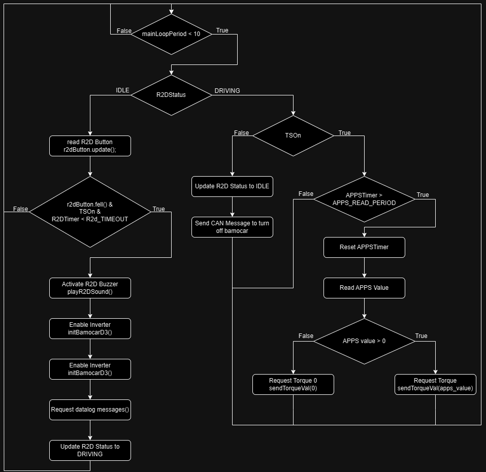
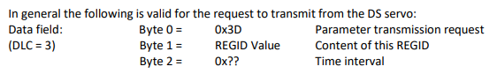

# Caixa 1 e Caixa 3


#### Initial notes:  
TeensyC1 - Caixa 1 - Located inside PCBs box

TeensyC3 - Caixa 3 - Located behind DashBoard

BMS - Battery Management System - Inside TSAC

Bamocar - Inverter/Controller

APPS - Accelerator Pedal Position Sensor - Pedal Box

BL - Brake Light

#### TeensyC1 Functionalities:

- BL Logic
- Logging
- CAN BUS Sniffer (Bamocar, BMS and TeensyC3)

#### TeensyC3 Functionalities:

- APPS (Reading and check plausibility)
- R2D (Logic + sound)
- Display
- Communication with Bamocar

### Timers

All timers are made with ElapsedMillis. This library makes this easy by allowing you to create variables (objects) that automatically increase as time elapses. [Documentation](https://github.com/pfeerick/elapsedMillis/wiki)

## TEENSYC1

### BL Logic

Input: Brake sensor (BRAKE_SENSOR_PIN, A5)

Output: Brake Light Command (BRAKE_LIGHT, 2)


### Logging

This writes the data to a .csv file inside an SD card.  
Teensy 4.1 already has a slot for an SD Card.  
The function write_to_file() is inside logging.cpp, it is not relevant for this part.


### CAN BUS Sniffer

This microcontroller is one node of our CAN bus.  
CAN bus is a broadcast type of bus.  
At the beginning of the code we perform the CAN bus setup: canbusSetup()

In this setup, we enable a filter to only deal with important messages for this node. this filter has a FIFO logic (first in first out)  
In this case, we only allow messages with ID 0x111, 0x666 and 0x181, which are APPS values from teensyC3, BMS and Bamocar, respectively.

When the TeensyC1 receives one message with one of the valid IDs, it calls canbusSniffer().  

[CAN_BAMOCAR.pdf](https://drive.google.com/file/d/1UVcGhsBRz_DpuVszRFBb6By628RkIuaZ/view?usp=sharing) <- Here you have all the CAN Documentation of the inverter

Receive address Rx ID = 0x201

Transmit address Tx ID = 0x181

Transmission rate NBT = 4025 (→ 500 kBaud)

BMS message has been configured by the team in the Orion BMS Software.

BMS id = 0x666

Caixa 3 also sends information to Caixa 1, the APPS value to log it.

### Timers

All timers are made with ElapsedMillis. This library makes this easy by allowing you to create variables (objects) that automatically increase as time elapses. [Documentation](https://github.com/pfeerick/elapsedMillis/wiki)

## TEENSYC3

### Main loop

Inputs:

- APPS 1 (APPS_1_PIN, 41)
- APPS 2 (APPS_2_PIN, 40)
- R2D Button (R2D_PIN, 32) -> uses [Bounce2 Lib](https://github.com/thomasfredericks/Bounce2)

Outputs:

- Buzzer (buzzerPin, 4)



### Button Lib

[Documentation](https://github.com/thomasfredericks/Bounce2) -> The mechanical part of buttons and switches vibrate slightly when closed or opened causing multiple undesired false states (similar to noise). This library filters out these undesired state changes.

In this case, we only use the function fell() that returns true if the pin signal transitions from high to low since the last update.

### TSOn

TS means Tractive System. If TS is on, it is because the shutdown system is closed (everything has no errors and the pilot requests to turn on the TS).  
C3 Teensy knows that TS is on because Bamocar has one register that saves the DC voltage and if DC Voltage > 0, that is because the TS is on.

### CANSniffer

This teensy also has a FIFO Filter

only accepts messages from:

- C1_ID (with Brake sensor value)
- R2D_ID (this is just for debugging and override R2D logic aka setting R2D status to Driving)
- BMS_ID (I think that this is not used)
- BAMO_RESPONSE_ID (all messages from bamocar)

### R2D Logic

#### R2D Rules:  

**EV4.11.6**

The vehicle is in Ready-to-drive (R2D) mode as soon as the motor(s) will respond to the input of the APPS.

**EV4.11.7**

After the TS has been activated, additional actions must be required by the driver to set the vehicle to R2D mode, e.g. pressing a dedicated start button. The transition to R2D mode must only be possible during the actuation of the mechanical brakes and a simultaneous dedicated additional action.

**EV4.11.8**

The R2D mode must be left immediately when the SDC is opened.

To enter the R2D logic all these conditions must be true:

- r2dButton.fell()
  - The button on the dashboard has been pressed
- TSOn
  - Already explained
- R2DTimer < R2D_TIMEOUT
  - Every time the brake sensor is pressed, the C1 teensy, reads the brake sensor value and sends it to the CAN BUS, Upon reading that message, C3 checks if the brake pressure is greater than a threshold (165) and if that is the case, the R2DTimer is reset.
  - This not only checks if the brake pedal has been pressed but also creates a small delay (R2D_TIMEOUT = 500 ms) to remove “bad timing”

If that is true:

- The R2D Sound that it is just:

```c++
void playR2DSound() {
    digitalWrite(buzzerPin, HIGH);
    delay(1000);
    digitalWrite(buzzerPin, LOW);
}
```

- initBamocarD3
    1. Clear bamocar errors 
        ```c++
        can1.write(clearErrors);
        ```

- 1. Turn on Bamocar Transmission
        ```c++
        while (not transmissionEnabled and CANTimer > CANTimeoutMS) {
            can1.write(transmissionRequestEnable);
            CANTimer = 0;
        }
        ```
- 1. Check if BTBReady is true (BTBReady True means ready for operation)
        ```c++
        while (not BTBReady and CANTimer > CANTimeoutMS) {
            can1.write(BTBStatus);
            CANTimer = 0;
        }
        ```
- 1. Enable the driver to respond to the APPS signal ([Bamocar documentation page 27](https://drive.google.com/file/d/1AB3R3GgfrNnoZevtf9uZ19a8wwtScbqD/view?usp=sharing))
        ```c++
        can1.write(noDisable);
        ```

#### Notes about BTBReady:

When we receive a message from BAMOCAR (the id is BAMO_RESPONSE_ID) and the content (msg.buf) equals the predefined message “BTBResponse” the BTBReady variable is set to true.  
This message “BTBResponse” was defined based on [this](https://drive.google.com/file/d/1UVcGhsBRz_DpuVszRFBb6By628RkIuaZ/view?usp=sharing) document, page 19 shows two routine examples here we can see the expected response when BTB is closed (ready for operation).

### request_dataLog_messages()

This function enables a set of values from the BAMOCAR to be sent to the CAN BUS periodically.



Even though the logging itself is performed in the C1 teensy, these messages are requested here to only start the logging when the car is in R2D mode.

### APPS

```c++
if (APPSTimer > APPS_READ_PERIOD_MS) {
    APPSTimer = 0;
    int apps_value = readApps();
    if (apps_value >= 0)
    sendTorqueVal(apps_value);
    else
    sendTorqueVal(0);
    break;
}
```
This is a diagram of the readApps() function:


These are the real values of apps:


This image is just an example to show the meaning of the variables used in the code.


This has been removed in the 2024 FSG Rules but this code implements this feature.

CAN BUS ID TABLE

| ID  | Description |
| --- | --- |
| 0x123 | C1_ID (message with brake sensor value) |
| 0x665 | R2D_ID (this is just for debugging and override R2D logic aka setting R2D status to Driving) |
| 0x675 | BMS_ID |
| 0x201 | BAMO_COMMAND_ID |
| 0x181 | BAMO_RESPONSE_ID |
| 0x666 | BMS_ID (message for C1 with logging info) |
| 0x111 | C3_ID (message with APPS value) |
