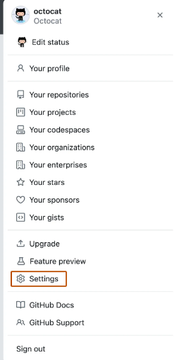

# Environment Setup

## Links
- [Platformio documentation](https://docs.platformio.org/en/latest/)
- [VSCode](https://code.visualstudio.com/Download)
- [Platformio ini file](https://docs.platformio.org/en/latest/projectconf/index.html)

## Git

If you already use git and github, you can skip this step. If you use windows, make sure to be inside your wsl for this.

### Installation

```sh
sudo apt install git
```

[for windows](https://git-scm.com/downloads).

### Configuration

Configure according to github account. For global configuration:

```sh
git config --global user.name "username"
git config --global user.email "useremail"
```

To configure independently per project:

```sh
git config user.name "username"
git config user.email "useremail"
```

### SSH connection to Github

1. Generate ssh key pair:
    ```sh
    ssh-keygen -t ed25519 -C "your_email@example.com"
    ```
    You can leave the default file. Setup password if you wish.
2. Start the ssh-agent in the background:
    ```sh
    eval "$(ssh-agent -s)"
    ```

	or on windows:

	```sh
	Set-Service -StartupType Automatic
    Start-Service ssh-agent
	```
1. Add the ssh key to the agent:
    In Ubuntu:
    ```sh
    ssh-add ~/.ssh/id_ed25519
    ```
    In Windows:
    ```sh
    ssh-add c:/Users/<user>/.ssh/id_ed25519
    ```
1. Copy the SSH public key to your clipboard:
    ```sh
    cat ~/.ssh/id_ed25519.pub
    # Then select and copy the contents of the id_ed25519.pub file
    # displayed in the terminal to your clipboard
    ```

    in windows:
    ```sh
    cat c:/Users/<user>/.ssh/id_ed25519.pub
    # Then select and copy the contents of the id_ed25519.pub file
    # displayed in the terminal to your clipboard
    ```
    **Tip:** Alternatively, you can locate the hidden .ssh folder, open the file in your favorite text editor, and copy it to your clipboard.
1. In the upper-right corner of any page, click your profile photo, then click Settings.

    

    Screenshot of GitHub's account menu showing options for users to view and edit their profile, content, and settings. The menu item "Settings" is outlined in dark orange.
    In the "Access" section of the sidebar, click  SSH and GPG keys.
1. Click New SSH key or Add SSH key.
1. In the "Title" field, add a descriptive label for the new key. For example, if you're using a personal laptop, you might call this key "Personal laptop".
1. Select the type of key, either authentication or signing. For more information about commit signing, see "About commit signature verification."
1. In the "Key" field, paste your public key.
1. Click Add SSH key.
1. If prompted, confirm access to your account on GitHub. For more information, see "Sudo mode."

For more details on that, checkout the Github tutorials: [Generating a new SSH key](https://docs.github.com/en/authentication/connecting-to-github-with-ssh/generating-a-new-ssh-key-and-adding-it-to-the-ssh-agent) and [Adding a new SSH key to your GitHub account](https://docs.github.com/en/authentication/connecting-to-github-with-ssh/adding-a-new-ssh-key-to-your-github-account). 

## Cloning the project

Before anything else, you need to clone the project into your laptop using [git](https://git-scm.com/book/en/v2/Getting-Started-About-Version-Control). Simply hit clone in the home page of the project, select ssh, copy the command and run git clone, or:
```sh
git clone git@github.com:fs-feup/el-sw.git
```

## Project Structure

The project is divided into multiple Platform.io projects, each corresponding to a Teensy.

## IDE


Visual Studio Code is a general purpose IDE very widely used. VSCode is our choice due to the great quantity of extensions available, especially the Platform.io Extension.


### Platformio Manual Installation
1. Install vscode
2. Make sure you have python3 installed
3. Install python3-venv: ```sudo apt install python3-venv```
4. Install gcc
	```sh
	sudo apt install build-essential
	```
5. Install [platformio extension](https://platformio.org/install/ide?install=vscode)
6. Open platformio extension in vscode

Suggested extensions
- [Github Pull Requests](https://marketplace.visualstudio.com/items?itemName=GitHub.vscode-pull-request-github)
- [Github Copilot](https://marketplace.visualstudio.com/items?itemName=GitHub.copilot)
- [Gitlens](https://marketplace.visualstudio.com/items?itemName=eamodio.gitlens)

### Configuring system for uploads (Linux)

Lastly, you need to update/create a file in a certain location to allow uploads to the teensy via USB port. The file is the following:

```sh
# UDEV Rules for Teensy boards, http://www.pjrc.com/teensy/
#
# The latest version of this file may be found at:
#   http://www.pjrc.com/teensy/00-teensy.rules
#
# This file must be placed at:
#
# /etc/udev/rules.d/00-teensy.rules    (preferred location)
#   or
# /lib/udev/rules.d/00-teensy.rules    (req'd on some broken systems)
#
# To install, type this command in a terminal:
#   sudo cp 00-teensy.rules /etc/udev/rules.d/00-teensy.rules
#
# After this file is installed, physically unplug and reconnect Teensy.
#
ATTRS{idVendor}=="16c0", ATTRS{idProduct}=="04*", ENV{ID_MM_DEVICE_IGNORE}="1", ENV{ID_MM_PORT_IGNORE}="1"
ATTRS{idVendor}=="16c0", ATTRS{idProduct}=="04[789a]*", ENV{MTP_NO_PROBE}="1"
KERNEL=="ttyACM*", ATTRS{idVendor}=="16c0", ATTRS{idProduct}=="04*", MODE:="0666", RUN:="/bin/stty -F /dev/%k raw -echo"
KERNEL=="hidraw*", ATTRS{idVendor}=="16c0", ATTRS{idProduct}=="04*", MODE:="0666"
SUBSYSTEMS=="usb", ATTRS{idVendor}=="16c0", ATTRS{idProduct}=="04*", MODE:="0666"
KERNEL=="hidraw*", ATTRS{idVendor}=="1fc9", ATTRS{idProduct}=="013*", MODE:="0666"
SUBSYSTEMS=="usb", ATTRS{idVendor}=="1fc9", ATTRS{idProduct}=="013*", MODE:="0666"

#
# If you share your linux system with other users, or just don't like the
# idea of write permission for everybody, you can replace MODE:="0666" with
# OWNER:="yourusername" to create the device owned by you, or with
# GROUP:="somegroupname" and mange access using standard unix groups.
#
# ModemManager tends to interfere with USB Serial devices like Teensy.
# Problems manifest as the Arduino Serial Monitor missing some incoming
# data, and "Unable to open /dev/ttyACM0 for reboot request" when
# uploading.  If you experience these problems, disable or remove
# ModemManager from your system.  If you must use a modem, perhaps
# try disabling the "MM_FILTER_RULE_TTY_ACM_INTERFACE" ModemManager
# rule.  Changing ModemManager's filter policy from "strict" to "default"
# may also help.  But if you don't use a modem, completely removing
# the troublesome ModemManager is the most effective solution.
```

The instructions for the installation of the file are in the file's comments.
