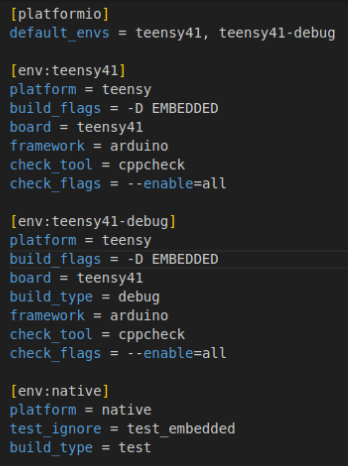

# New Project Setup

## Prerequisites

- Git set up with GitHub and ssh
- VSCode

You can find tutorials for this [here](https://github.com/fs-feup/autonomous-systems/blob/main/docs/tutorials/environment_setup/coding_environment.md) (ignore parts rephering to ROS).

## Links
- [Unit Testing with Platformio tutorial](https://www.youtube.com/watch?v=KPesyRp8qqo&t=1s)
- [Platformio documentation](https://docs.platformio.org/en/latest/)

## Example Project
[Here](./Test%20Project/)

## Two Ways to Set Up

You can either:
- install platformio on your computer manually
- set up the docker development container

### Docker Dev Container

A .devcontainer folder exists in the root of this repository already configured for a docker development container to work with VSCode. The docker development container will enable you to program without installing any dependencies directly in your computer. 

1. Install vscode
2. Install docker ([guide in AS repo](https://github.com/fs-feup/autonomous-systems/blob/main/docs/tutorials/environment_setup/docker-install.md))
2. Install remote development extension (can follow [set up guide in AS repo](https://github.com/fs-feup/autonomous-systems/blob/main/docs/tutorials/environment_setup/coding_environment.md) for full setup (ignore ROS2 parts))
3. Do CTRL+SHIFT+P and select `Dev Containers: (Re-)build and Reopen in Container` and execute (in the root folder of the repo)

That's it, all should be installed automatically. To program in each project, you still need to navigation Platform.io to open each project individually. This can be configured through the line in the [settings.json](./test_project/.vscode/settings.json) file in the test project:
```json
{
    "platformio-ide.pioHomeServerHttpPort": 8008
}
```

One more important factor: you need to set Platform.io's port to 8008 if using the dev container, or else pages from the integrated IDE will be blank.

### Platformio Manual Installation
1. Install vscode
3. Make sure you have python3 installed
4. Install python3-venv: ```sudo apt install python3-venv```
5. Install gcc
	```sh
	sudo apt install gcc
	sudo apt install g++
	```
2. Install [platformio extension](https://platformio.org/install/ide?install=vscode)
6. Install platformio on pc (optional)
	```sh
	sudo apt install python3-pip
	pip install -U platformio
	```
7. Open platformio extension in vscode

## Creating project
In case you need to create a new project for a new microcontroller.
### Creating new project
1. Select PIO Home - Home
2. New Project
3. Select the hardware
4. You are done
### Configuring project
How to configure a project for **EL&SW** boards at FS FEUP:
1. Notes on the base structure of the project:
	1. **include** folder contains header files (hpp) - almost all programming goes here, all testable code goes here
	2. **src** folder contains executable files
	3. **lib** folder contains external libraries
	4. **test** folder contains unit tests
2. create 'comm', 'embedded' and 'logic' sub-folders inside *include* (purely organizational as of now)
	1. **comm** folders contain the code related to communication (CAN). No files external to this folder should include information on ports, communication protocols or include CAN libraries. Files from this folder should not contain any other logic other than pure translation from CAN to useful information.
	2. **embedded** folder contains the code related to IO operations with the board, which require inclusion of Arduino.h library or any other resource only available when connected to a board. Files from this folder should not contain any other logic other the direct calling functions and classes to the board's functionalities.
	3. **logic** folder contains the code regarding all the logic of the actual programs running in the boards. This folder should not contain calls to either communication or embedded libraries. This folder can and should be further subdivided if it contains many files. 
3. create 'test_comm', 'test_embedded' and 'test_logic' and 'test_logic_native' (logic that can be tested on pc) sub-bfolders inside *test*
4. In platformio.ini
	1. 
	2. under [platformio] general rules are defined 
		1. **default_envs** defines the default environments to be compiled (exclude native so that it is not built to the board, it will fail)
	3. under [env:name] we define a development environment with the name "name"
		1. **platform** defines the environment it should work in
		2. **build_flags** is used to define flags, which in this case is used for the compiler to know which files to compile, either PC's SOCKET CAN communications of Teenzy's FLEX CAN communications code
		3. **board** defines the model of the board
		4. **build_type** can configure some definitions. The debug type enables the code to be executed step by step (in debug mode) in the board, with a tool that provides an inside view into the state of the variables and program. More information [here](https://docs.platformio.org/en/latest/projectconf/build_configurations.html).
		5. **framework** defines the framework of the board
		6. **check_tool** defines the static analysis tool to be used. To run static analysis, run ```pio check```
		7. **test_ignore** sets the test folders to ignore in the given environment
		8. More information on the platformio.ini can be found [here](https://docs.platformio.org/en/latest/projectconf/index.html)
The way the platformio.ini file is defined, the native environment is only made to be used for running tests and is not compiled by default.
## Code
The projects are supposed to follow the folder structure that is defined in. However, this is not the only requirement for the code to work properly.
### Using Executable Files (.cpp in src)
By default, the tests defined with unity only fetch files from the include folder (.hpp) files. There is a flag that can allow them to also fetch files from the src folder but this action will lead the tests to include the main file, which includes the Arduino library, which is not present in the desktop and thus will remove the tests' ability to be run in desktop. What this means is a change in paradigm of development: all code that should be tested should be entirely defined in the include folder, in .hpp files. This means the only executable files (.cpp) in the project are ones that contain calls to these header files' components, such as the main files and few other helper programs. In conclusion -> code in .hpp files in the include directory.
## Compiling and Running
You can use the platformio functions both through the VSCode gui or the terminal. I prefer the terminal as it is easier to set some options. To upload the project into the board, simply run:
```sh
pio run
```
To select a certain environment:
```sh
pio run --environment teensy41
```
The native environment is not selected by default.
You can also start a debug session using:
```sh
pio debug
```
For more information on debugging, visit [this](https://docs.platformio.org/en/latest/plus/debugging.html). For more tools, run:
```sh
pio -h
```
## Testing
### CLI
To run the tests in the desktop:
```sh
pio test --environment native
```
This will not run the tests in the *test_embedded* folder, as the environment is set to ignore them.
To run the tests when using a teensy:
```sh
pio test
```
More information on commands can be found [here](https://docs.platformio.org/en/latest/core/userguide/cmd_test.html).
### Unit Testing
Some examples test files were developed in the project to demonstrate how they should be written:
1. Folder separation
2. Unit testing - each test tests only one function/method and one scenario of that function
3. Each test file should correspond to one implementation file and be name 'test_<file_name>', to improve traceability
The test framework used is **unity**. It was chosen due to having support with platformio out of the box and being able to run tests both in native environment and embedded. To get more information on the framework, visit [this website](https://docs.platformio.org/en/latest/advanced/unit-testing/frameworks/unity.html#unit-testing-frameworks-unity). More information in pio testing can be found [here](https://docs.platformio.org/en/latest/advanced/unit-testing/index.html).
### Testing Environments
Some tests can be run on the computer, as they only depend on logic or ever present libraries. However, many of the tests depend in some way of functionalities inherent to arduino. As such, most testing will be performed using a breadboard for testing with a Teensy. Soon...

## Static Analysis
Platformio is capable of including a static analysis tool, like cppcheck, which is the one we will use. To run the static analysis, do:
```sh
pio check
```
This action takes quite long, to execute it only in one environment (with the setup defined, the code would be reviewed in duplicate), use:
```sh
pio check --environment teensy41
```
If the pio check gets stuck with no results for more than 5 minutes, update pio:
```sh
pio upgrade --dev
```
The static analysis tool chosen was **cppcheck**, as it is a well established and complete tool.

## Documentation
In order to pass down the knowledge aquired to the next generations of engineers and to make the code developed easier to understand, it is fundamental that both the code, system design and architecture and decisions are all documented.
- For code documentation, we will be using **Doxygen**.

### Doxygen C++
C++ code example:
```c++
/**
 * @brief Class for Kalman Filter
 * Used for SLAM
 * 
*/
class KalmanFilter {

 public:
  /**
   * @brief Base constructor
   * 
   * @param MotionModel motion_model motion model to be used
   * @param ObservationModel observation_model validation model to be used
   * 
  */ 
  KalmanFilter(const MotionModel& motion_model, const ObservationModel& observation_model);
}

```
## Other ideas
In the future, the most important ideas to study are:
- Development of system-level tests
- Executing the programs in the native environment (not that relevant)
- Testing and Checking automation with github actions
- Better visualization options for documentation
## Notes
- No board was used while developing this tutorial, some of the code and instruction on the teensy's part might have errors.
## Links
- [Platformio ini file](https://docs.platformio.org/en/latest/projectconf/index.html)
- [CAN Tutorials](https://www.youtube.com/watch?v=9db-q5ffYpU)
- [VCAN Network Tutoial](https://www.youtube.com/watch?v=iUgaoTJiO70)
