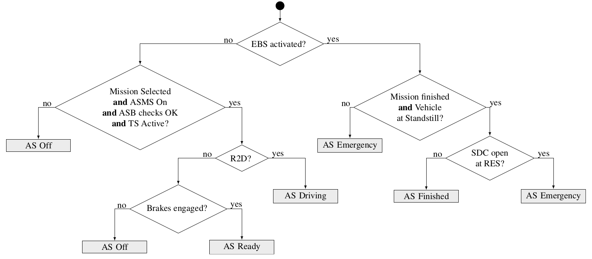
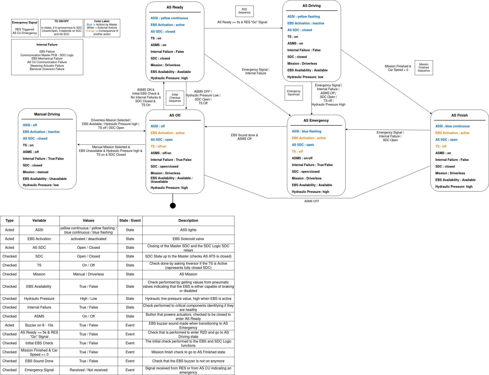
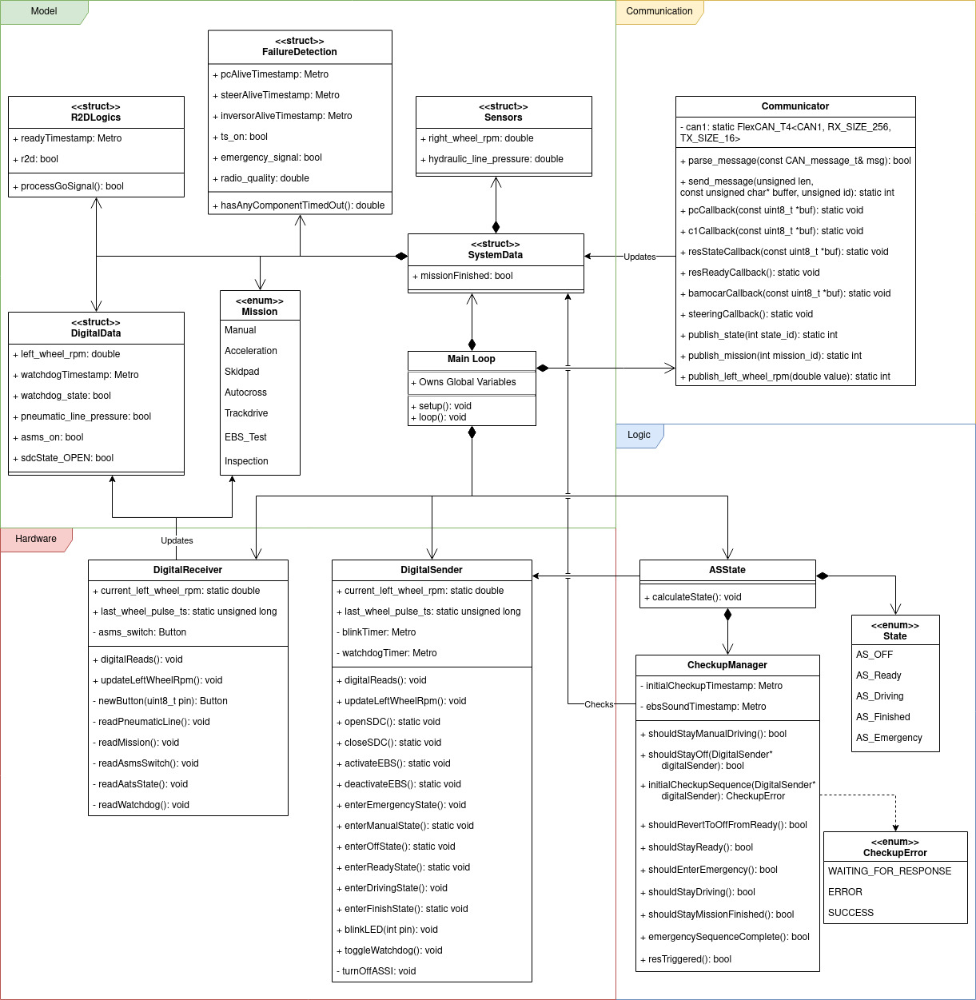

# Master PCB

The Master PCB is responsible for calculating and publishing the AS state that the car should be in and performing all the necessary actions required to achieve it (i.e.: opening the shutdown circuit, activating the emergency braking system...). The state is correctly identifiable by the following flowchart, as required by rule **T14.9.2**: "*The status of the AS must be determined according to the flowchart in Figure 17.*

Although the above diagram can determine the state, **it is only meant for externally determining the ASState**, it is **not** how the state is calculated.

## State Machine
The PCB reads values from all the hardware connected to it, as well as CAN, to then calculate the state it needs to be in (change may or not be necessary), based on the state it currently is in. The "default" state is AS_OFF, and then each state onward is calculated by the following state machine:

Inside we can see all the requirements to transition from one state to another. The Initial Checkup Sequence is crucial for the transition to AS_Ready and is as follows:

In AS_Ready and AS_Driving, we need to continuously monitor the car in order to verify no system failures or emergencies in general arise:

## Main Loop Sequence
### Set-up
Before calculating the state, we need to define some CAN callbacks. They are used to receive RES signals, brake pressure, TS state, wheel information, mission information, emergencies, and timestamps (the computing unit, inversor, and steering pcb all need to send "alive" signals at a fixed rate, to confirm they operational). Those  callbacks are asynchronous, which means that they will shortly interrupt the main loop when data from a topic the master node is subscribed to is received to update the relevant variables. We also need to define the operation modes of all the pins that we will be sending and receiving information from.
### Loop
During the main loop, we first read all the values from the necessary components (Sensors, AMI, Switches, SDC Logic, EBS, ASSI). After this we calculate and update the state through a sequence of monitoring sequences, updating components' variables as depicted in the following diagram. After this, state and other variables are sent out to the rest of the system.

## System Details
The code is divided into 4 main groups:
- **Model:** This is responsible for storing all the important information used by other classes. It stores all pin signals and decoded CAN data read by the Digital Receiver and Communicator, respectively. This information is structured so that we can pass only the relevant information to the classes that use it using pointers.
- **Communication:** Responsible for parsing, sending, and receiving CAN messages. It also sets up all the necessary callbacks.
- **Hardware:** Responsible for reading and updating all hardware information. It provides an abstraction layer, allowing for direct calls such as `openSDC()` without requiring low-level knowledge of the pin layout of the Teensy Master. Responsible for performing most of the operations required for a state transition.
- **Logic:** The "brain" of the system. This is where the state logic lies. In each state, the required checks done by the Checkup Manager, such as the initial checkup sequence (required to transition from AS_OFF to AS_Ready) and the continuous monitoring sequence (which will transition from AS_READY/AS_Driving to AS_Emergency, i.e.). Refer to the State Machine Diagram above for more detailed information regarding the logic.

The diagram below depicts the system in its entirety. The filled diamond arrows depict direct ownership (diamond at the parent), while normal arrows depict access through pointers/references (arrowhead at child)

