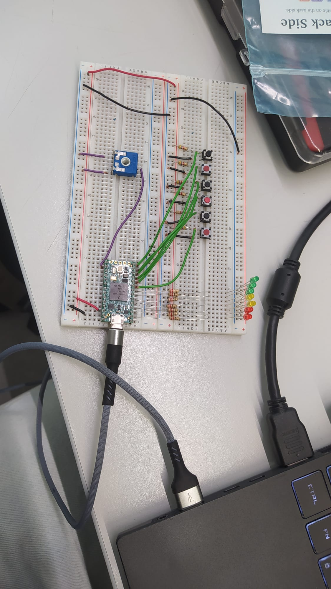
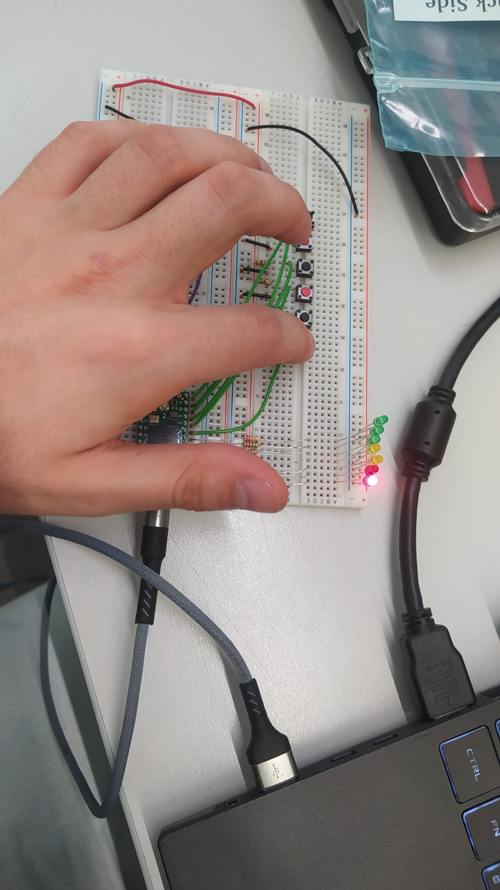

# Testing

## Links
- [Unit Testing with Platformio tutorial](https://www.youtube.com/watch?v=KPesyRp8qqo&t=1s)

## Unit Testing

Firstly, check the rules on Unit Testing in [Notion](https://www.notion.so/Coding-Guidelines-2a14cfa826a846f1845f89e5cc54b0ec?pvs=4).

### Test Framework
The test framework used is **unity**. It was chosen due to having support with platformio out of the box and being able to run tests both in native environment and embedded. To get more information on the framework, visit [this website](https://docs.platformio.org/en/latest/advanced/unit-testing/frameworks/unity.html#unit-testing-frameworks-unity). More information in pio testing can be found [here](https://docs.platformio.org/en/latest/advanced/unit-testing/index.html).


## Testing Environments and Test types

Some tests can be run on the computer, as they only depend on logic or ever present libraries. However, many of the tests depend in some way of functionalities inherent to arduino. As such, most testing will be performed using a breadboard for testing with a Teensy.

Apart from the environment, the tests can also vary in the **type of test**, between true unit test and protocol tests (and integration tests, which are simply tests that test many components at once).

### Environments

Tests in the **native environment** should be always in the test_logic_native. These tests can be ran in automated workflows and in your own pc. When creating a test (or any type of software), try to as much as possible have it be testable in computer (native) environment.

**Embedded tests** will be performed with the aid of a breadboard, which was configured to be able to simulate almost any behaviour of the goal PCB. 
As the connection to the microcontroller's pin out are not the same, embedded tests also need to redefine the constants that define the values of the pins.

As mentioned, for the embedded tests, a breadboard was built, along with a test project for it, which can be used to check all the components in it are still working. The [test project](../../bread-board-test/):
- configures buttons to light leds up
- potenciometer to light last led up according to the value
Use this if you suspect there is something wrong with the breadboard.




The breadboard will be available in the B320 classroom, take good care of it.

### True Unit Tests

These are the tests that do not depend on user input, even if they require hardware because of some library. They are meant to be developed as any typical unit test, just like described in the rules.

### Protocol Tests

These tests are different, as they depend on user input. These tests are always meant to be ran in the embedded environment. For these tests, the typical test structure should still be followed. However, this is no longer enough to define the test. In addition, the test must be accompanied by a guide to the interactions that should be made with the board. This guide can be described as a doxygen comment to the test, like so:

```c++
/**
 * @attention PROTOCOL TEST
 * @brief Test the communications module
 * Simply here to show the execution of 
 * CAN communication in desktop
 * PROTOCOL:
 * 1. Click A1
 * 2. Click A2
 * 3. Verify LED2 Green
*/
void test_x(void) {
    // Logic of the test
}
```

As depicted, these steps can have both actions and assertions to be performed by the user himself (not necessarily both, some tests may only require actions and all assertions be made in code).

## Testing

To run the tests in the desktop:
```sh
pio test --environment native
```
This will not run the tests in the *test_embedded* folder, as the environment is set to ignore them.
To run the tests when using a teensy:
```sh
pio test
```
More information on commands can be found [here](https://docs.platformio.org/en/latest/core/userguide/cmd_test.html).

## Static Analysis
Platformio is capable of including a static analysis tool, like cppcheck, which is the one we will use. To run the static analysis, do:
```sh
pio check
```
This action takes quite long, to execute it only in one environment (with the setup defined, the code would be reviewed in duplicate), use:
```sh
pio check --environment teensy41
```
If the pio check gets stuck with no results for more than 5 minutes, update pio:
```sh
pio upgrade --dev
```
The static analysis tool chosen was **cppcheck**, as it is a well established and complete tool.