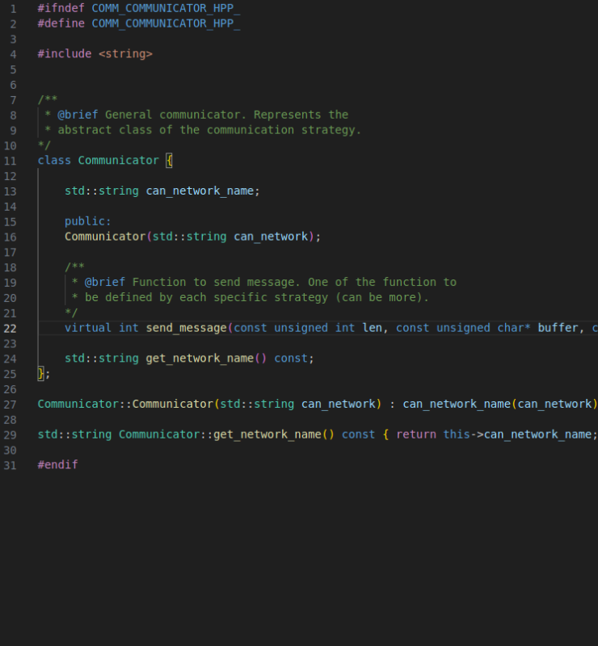
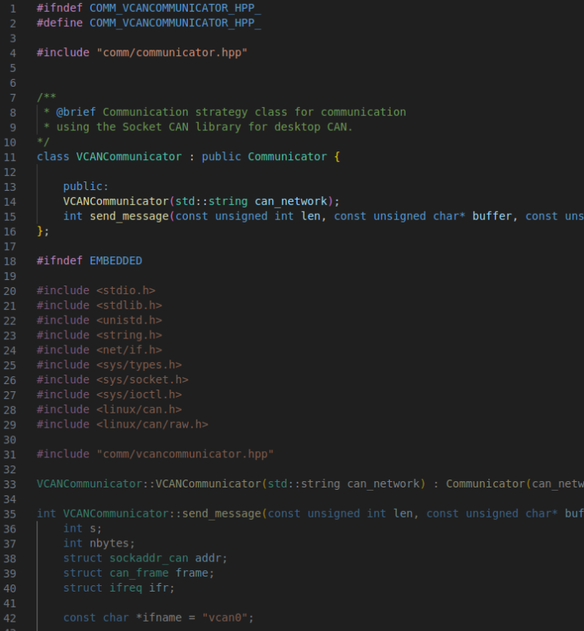
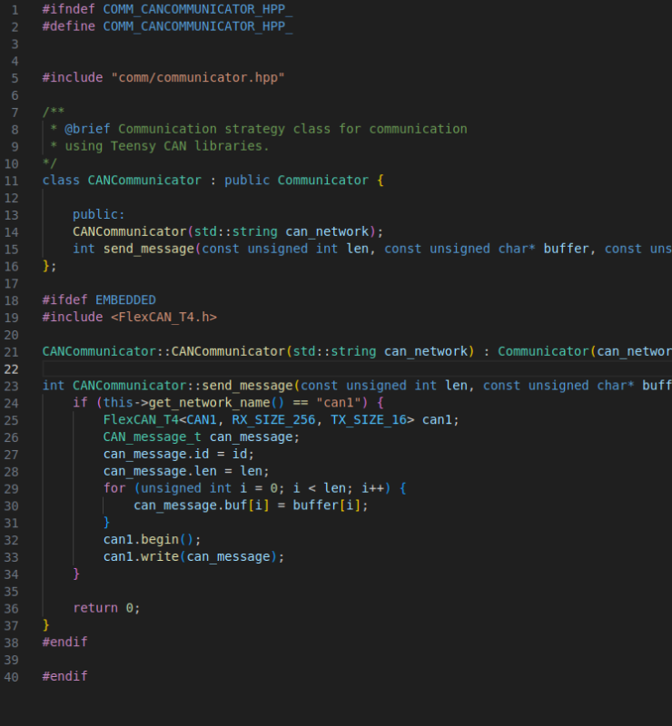
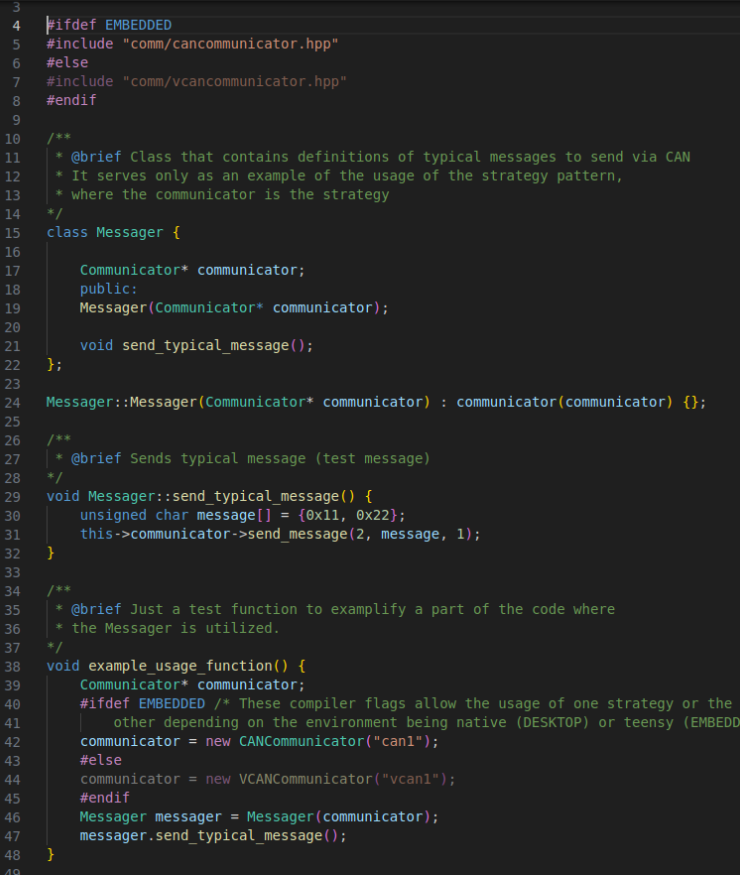

# Virtual CAN

THIS IS UNUSED FOR NOW.
## Links
- [Socket CAN library](https://en.wikipedia.org/wiki/SocketCAN)
- [CAN Tutorials](https://www.youtube.com/watch?v=9db-q5ffYpU)
- [VCAN Network Tutoial](https://www.youtube.com/watch?v=iUgaoTJiO70)

## Set up Virtual CAN Network

These steps enable you to setup a can virtual network on your computer. With this network, you can utilize programs inside your computer and let them communicate through the network.
1. Add linux kernel module:
```sh
sudo modprobe vcan
```
2. (Every pc reboot) Add can network:
```sh
sudo ip link add dev vcan0 type vcan
```
3. (Every pc reboot) Bring the virtual CAN interface online: 
```sh
sudo ip link set up vcan0
```
4. Check configuration:
```
ifconfig vcan0
```
5. (Optional) install can-utils:
```
sudo apt install can-utils
```
1. Generate and listen to can packets:
	1. In one terminal:
	```sh
	cangen vcan0
	```
	2. On the other:
	```sh
	candump vcan0
	```

### Communication (CAN) Interface
The Linux kernel supports add-ons that enable communication channels using CAN protocol to be established. As described in an earlier section of this tutorial, it is possible to create a virtual CAN network, which enables programs to communicate via CAN inside the computer. However, the libraries used by Teensys to create CAN messages and communicate them *(FlexCAN_T4.h)* are not the same libraries used for the linux kernel *(linux/can.h and linux/can/raw.h - SocketCAN)*. As such, we need to perform a little trick to be able to test code related to the communications part in the computer: **program two communication modules for each environment with the same function signatures and abstract them through a parent class - Strategy Design Pattern.** An example of this pattern can be seen in the example project.
#### Strategy Pattern
The base class is the Communicator class. It defines an interface to be used for the rest of the system to communicate via CAN. It is an abstract class, an abstraction of the communication. It respects the Dependency Inversion principle: "Rely on abstractions, not higher level modules.".

The VCAN Communicator implements the aforementioned abstract class and defines the send_message function. The send_message function will use the necessary code from the Socket CAN libraries to send a message via CAN to the corresponding network. 

The CAN Communicator also implements the Communicator base class and is another strategy at communication, which uses the Teensy library for CAN Communication.

This way, the rest of the system only depends on the base abstract class, respecting the SOLID principles. Following this pattern allows the rest of the program to not depend on the environment it is running on regarding the communication part. The only down side of this approach is that the Communicator's implementation can't be tested easily.
#### Compiler Flags
The difference in strategy is useful to enable the same code to run in desktop or in the board. However, it also has to compile in both. As the libraries being included are not present in both environments, we need to let the compiles know which strategy we want to use. For this, a **build-flag** was added in platformio.ini file to signal if the program is building for embedded system or not. The flag is only defined to the environments to be used for teensy. This way, we can use the #ifndef directive to tell the compiler what parts to compile or not. This can also be used when defining which strategy to use in the program, as depicted in the example to be provided next.
#### Example
An example of usage of this design pattern can be found in the comms.hpp file. The Messager class is just a class that is part of the communication module and defines some common behaviours of communication (an example). For the communication, it must use one of the strategies. It therefore contains a Communicator* as an attribute. When creating an instance of a Messager in the *example_usage_function*, we use the #ifdef directives to define what strategy to give to the messager. After that, we just need to use the messager normally, independent of the environment and libraries we are using.
