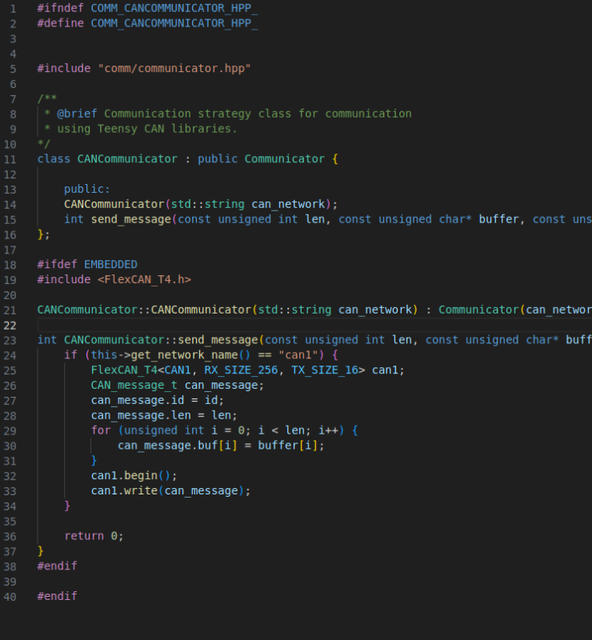

# New Project Setup

## Links
- [Socket CAN library](https://en.wikipedia.org/wiki/SocketCAN)

## Example Project
[Here](./Test%20Project/)
## Set up Virtual CAN Network
These steps enable you to setup a can virtual network on your computer. With this network, you can utilize programs inside your computer and let them communicate through the network.
1. Add linux kernel module:
```sh
sudo modprobe vcan
```
2. (Every pc reboot) Add can network:
```sh
sudo ip link add dev vcan0 type vcan
```
3. (Every pc reboot) Bring the virtual CAN interface online: 
```sh
sudo ip link set up vcan0
```
4. Check configuration:
```
ifconfig vcan0
```
5. (Optional) install can-utils:
```
sudo apt install can-utils
```
1. Generate and listen to can packets:
	1. In one terminal:
	```sh
	cangen vcan0
	```
	2. On the other:
	```sh
	candump vcan0
	```
## Platformio Installation
1. Install vscode
2. Install [platformio extension](https://platformio.org/install/ide?install=vscode)
3. Make sure you have python3 installed
4. Install python3-venv: ```sudo apt install python3-venv```
5. Install gcc
	```sh
	sudo apt install gcc
	sudo apt install g++
	```
6. Install platformio on pc
	```sh
	sudo apt install python3-pip
	pip install -U platformio
	```
7. Open platformio extension in vscode
## Creating project
### Creating new project
1. Select PIO Home - Home
2. New Project
3. Select the hardware
4. You are done
### Configuring project
How to configure a project for **EL&SW** boards at FS FEUP:
1. Notes on the base structure of the project:
	1. **include** folder contains header files (hpp) - almost all programming goes here, all testable code goes here
	2. **src** folder contains executable files
	3. **lib** folder contains external libraries
	4. **test** folder contains unit tests
2. create 'comm', 'embedded' and 'logic' sub-folders inside *include*
	1. **comm** folders contain the code related to communication (CAN). No files external to this folder should include information on ports, communication protocols or include CAN libraries. Files from this folder should not contain any other logic other than pure translation from CAN to useful information.
	2. **embedded** folder contains the code related to IO operations with the board, which require inclusion of Arduino.h library or any other resource only available when connected to a board. Files from this folder should not contain any other logic other the direct calling functions and classes to the board's functionalities.
	3. **logic** folder contains the code regarding all the logic of the actual programs running in the boards. This folder should not contain calls to either communication or embedded libraries. This folder can and should be further subdivided if it contains many files. 
3. create 'test_comm', 'test_embedded' and 'test_logic' sub-bfolders inside *test*
4. In platformio.ini
	1. 
	2. under [platformio] general rules are defined 
		1. **default_envs** defines the default environments to be compiled (exclude native so that it is not built to the board, it will fail)
	3. under [env:name] we define a development environment with the name "name"
		1. **platform** defines the environment it should work in
		2. **build_flags** is used to define flags, which in this case is used for the compiler to know which files to compile, either PC's SOCKET CAN communications of Teenzy's FLEX CAN communications code
		3. **board** defines the model of the board
		4. **build_type** can configure some definitions. The debug type enables the code to be executed step by step (in debug mode) in the board, with a tool that provides an inside view into the state of the variables and program. More information [here](https://docs.platformio.org/en/latest/projectconf/build_configurations.html).
		5. **framework** defines the framework of the board
		6. **check_tool** defines the static analysis tool to be used. To run static analysis, run ```pio check```
		7. **test_ignore** sets the test folders to ignore in the given environment
		8. More information on the platformio.ini can be found [here](https://docs.platformio.org/en/latest/projectconf/index.html)
The way the platformio.ini file is defined, the native environment is only made to be used for running tests and is not compiled by default.
## Code
The projects are supposed to follow the folder structure that is defined in. However, this is not the only requirement for the code to work properly.
### Using Executable Files (.cpp in src)
By default, the tests defined with unity only fetch files from the include folder (.hpp) files. There is a flag that can allow them to also fetch files from the src folder but this action will lead the tests to include the main file, which includes the Arduino library, which is not present in the desktop and thus will remove the tests' ability to be run in desktop. What this means is a change in paradigm of development: all code that should be tested should be entirely defined in the include folder, in .hpp files. This means the only executable files (.cpp) in the project are ones that contain calls to these header files' components, such as the main files and few other helper programs. In conclusion -> code in .hpp files in the include directory.
### Communication (CAN) Interface
The Linux kernel supports add-ons that enable communication channels using CAN protocol to be established. As described in an earlier section of this tutorial, it is possible to create a virtual CAN network, which enables programs to communicate via CAN inside the computer. However, the libraries used by Teensys to create CAN messages and communicate them *(FlexCAN_T4.h)* are not the same libraries used for the linux kernel *(linux/can.h and linux/can/raw.h - SocketCAN)*. As such, we need to perform a little trick to be able to test code related to the communications part in the computer: **program two communication modules for each environment with the same function signatures and abstract them through a parent class - Strategy Design Pattern.** An example of this pattern can be seen in the example project.
#### Strategy Pattern
The base class is the Communicator class. It defines an interface to be used for the rest of the system to communicate via CAN. It is an abstract class, an abstraction of the communication. It respects the Dependency Inversion principle: "Rely on abstractions, not higher level modules.".

The VCAN Communicator implements the aforementioned abstract class and defines the send_message function. The send_message function will use the necessary code from the Socket CAN libraries to send a message via CAN to the corresponding network. 

The CAN Communicator also implements the Communicator base class and is another strategy at communication, which uses the Teensy library for CAN Communication.

This way, the rest of the system only depends on the base abstract class, respecting the SOLID principles. Following this pattern allows the rest of the program to not depend on the environment it is running on regarding the communication part. The only down side of this approach is that the Communicator's implementation can't be tested easily.
#### Compiler Flags
The difference in strategy is useful to enable the same code to run in desktop or in the board. However, it also has to compile in both. As the libraries being included are not present in both environments, we need to let the compiles know which strategy we want to use. For this, a **build-flag** was added in platformio.ini file to signal if the program is building for embedded system or not. The flag is only defined to the environments to be used for teensy. This way, we can use the #ifndef directive to tell the compiler what parts to compile or not. This can also be used when defining which strategy to use in the program, as depicted in the example to be provided next.
#### Example
An example of usage of this design pattern can be found in the comms.hpp file. The Messager class is just a class that is part of the communication module and defines some common behaviours of communication (an example). For the communication, it must use one of the strategies. It therefore contains a Communicator* as an attribute. When creating an instance of a Messager in the *example_usage_function*, we use the #ifdef directives to define what strategy to give to the messager. After that, we just need to use the messager normally, independent of the environment and libraries we are using.

## Compiling and Running
You can use the platformio functions both through the VSCode gui or the terminal. I prefer the terminal as it is easier to set some options. To upload the project into the board, simply run:
```sh
pio run
```
To select a certain environment:
```sh
pio run --environment teensy41
```
The native environment is not selected by default.
You can also start a debug session using:
```sh
pio debug
```
For more information on debugging, visit [this](https://docs.platformio.org/en/latest/plus/debugging.html). For more tools, run:
```sh
pio -h
```
## Testing
### CLI
To run the tests in the desktop:
```sh
pio test --environment native
```
This will not run the tests in the *test_embedded* folder, as the environment is set to ignore them.
To run the tests when using a teensy:
```sh
pio test
```
More information on commands can be found [here](https://docs.platformio.org/en/latest/core/userguide/cmd_test.html).
### Unit Testing
Some examples test files were developed in the project to demonstrate how they should be written:
1. Folder separation
2. Unit testing - each test tests only one function/method and one scenario of that function
3. Each test file should correspond to one implementation file and be name 'test_<file_name>', to improve traceability
The test framework used is **unity**. It was chosen due to having support with platformio out of the box and being able to run tests both in native environment and embedded. To get more information on the framework, visit [this website](https://docs.platformio.org/en/latest/advanced/unit-testing/frameworks/unity.html#unit-testing-frameworks-unity). More information in pio testing can be found [here](https://docs.platformio.org/en/latest/advanced/unit-testing/index.html).
### Other Testing
It might be interesting to create some other types of tests. For instance, it might be interesting to create a test function that simply runs most functions of the board and possibly abstracts the behaviour of the board. This test can be used simply as a normal program to execute in pc and to test the communication between multiple boards. This type of testing should be included in a separate folder, but this will have to be reviewed later.
## Static Analysis
Platformio is capable of including a static analysis tool, like cppcheck, which is the one we will use. To run the static analysis, do:
```sh
pio check
```
This action takes quite long, to execute it only in one environment (with the setup defined, the code would be reviewed in duplicate), use:
```sh
pio check --environment teensy41
```
If the pio check gets stuck with no results for more than 5 minutes, update pio:
```sh
pio upgrade --dev
```
The static analysis tool chosen was **cppcheck**, as it is a well established and complete tool.
## CAN communication in Desktop
The test_comm_example.cpp file contains a simple test meant to show the execution. Executing this test will make a CAN message be sent into the vcan1 network. You need to set it up first as indicated in the beginning of this tutorial. Then, if you use candump from can-utils while executing the test, you will see the message arrive.
## Documentation
In order to pass down the knowledge aquired to the next generations of engineers and to make the code developed easier to understand, it is fundamental that both the code, system design and architecture and decisions are all documented.
- For code documentation, we will be using **Doxygen**.
### Doxygen Setup
In order to help future developers start contributing to this project, code should be easy to read and staightforward. However, this is easier said than done. For this reason, it is helpful to use a documentation tool to document the code developed. Doxygen is the de-facto tool for documentation in C++. To use it you should:
- [Install doxygen](https://www.doxygen.nl/download.html) in your machine (virtual machine in this case). Download the binaries version.
    - Download
    - Run ```sudo make install```
- Create doxygen file in the project home directory
    - Run ```doxygen -g``` on the command line
    - Copy the configuration of the example file
        - INPUT = ./
        - GENERATE_LATEX = NO
        - RECURSIVE = YES
- Comment the code with doxygen comments
    - Use [this vscode extension](https://marketplace.visualstudio.com/items?itemName=cschlosser.doxdocgen) for automatic doxygen documentation generation
- Run ```doxygen``` on the [root folder] to generate documentation.

There is an example doxyfile in the project. This doxyfile is configured to generate only html documentation (as oposed to latex + html). The documentation is therefore generated into html folder and can be consulted with a browser.
For more information on how to comment code or other details on doxygen, check [here](https://www.doxygen.nl/manual/index.html).
### Doxygen C++
C++ code example:
```c++
/**
 * @brief Class for Kalman Filter
 * Used for SLAM
 * 
*/
class KalmanFilter {

 public:
  /**
   * @brief Base constructor
   * 
   * @param MotionModel motion_model motion model to be used
   * @param ObservationModel observation_model validation model to be used
   * 
  */ 
  KalmanFilter(const MotionModel& motion_model, const ObservationModel& observation_model);
}

```
## Other ideas
In the future, the most important ideas to study are:
- Development of system-level tests
- Executing the programs in the native environment (not that relevant)
- Testing and Checking automation with github actions
- Abstracting the Arduino framework just like FlexCAN was
- Better visualization options for documentation
## Notes
- No board was used while developing this tutorial, some of the code and instruction on the teensy's part might have errors.
## Links
- [Platformio ini file](https://docs.platformio.org/en/latest/projectconf/index.html)
- [CAN Tutorials](https://www.youtube.com/watch?v=9db-q5ffYpU)
- [VCAN Network Tutoial](https://www.youtube.com/watch?v=iUgaoTJiO70)