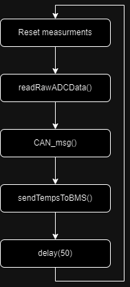
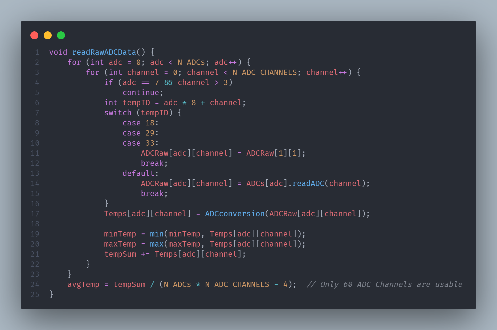
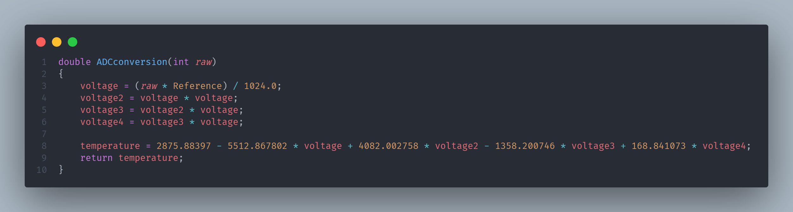
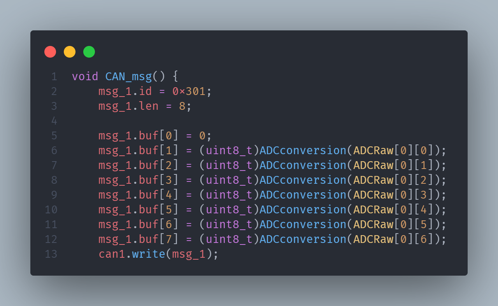
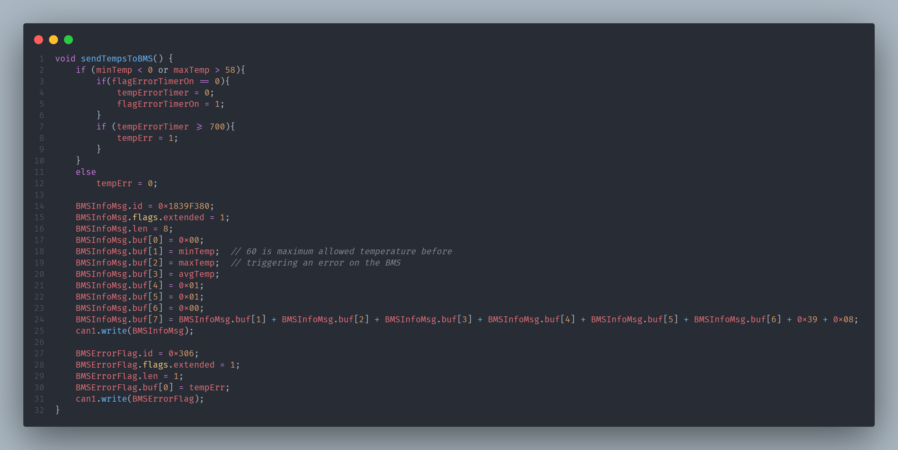

# Temperature Acquisition

The Temperature Acquisition is a PCB inside the TSA, Tractive System Accumulator.
This PCB has three main functions:
- Acquiring temperatures of at least 30% of the cells
- Monitoring those temperatures 
    - if >60ºC
    - Detect short-to-supply
    - Detect short-to-ground
- Monitoring errors from the BMS (second CAN BUS)

Sequence to open the Shutdown Circuit in case of a BMS error:
1. BMS - Detects an error;
6. BMS - Sets the Multi-Purpose Output 2 to low;
7. Latching - Open the Shutdown Circuit.

Sequence to open the Shutdown Circuit in case of a TempAcq error:
1. TempAcq - Detects an error;
2. TempAcq - Sends CAN msg;
3. BMS - Reads the TempAcq msg;
4. BMS - Sets the Multi-Purpose Output 2 to low;
5. Latching - Open the Shutdown Circuit.

The system we've implemented isn't flawless, but it's the best solution we could devise within the constraints of the competition rules. The main issue is that if CAN Communication is lost for any reason, the BMS cannot set the Multi-Purpose Output 2 to a low state. If this had been discovered during an inspection, our car would not have passed. We need to address this problem in the next prototype.

## Teensy TempAcq

This diagram represents the main loop:

### ReadRawADCData()

This function retrieves the ADC value using the Adafruit_MCP3008.h library. However, some readings consistently show errors, and the exact cause has not been identified yet—it could be due to the ADC itself, a PCB defect, a misconnection, etc... Currently, these inaccurate readings are disregarded, and we substitute them with the temperature from the first sensor, though this approach does not comply with the rules. The problematic readings are from TempIDs: 18, 29, 33.
The ADCraw values are later converted to a temperature in degrees Celsius by ADCconversion(). 

This is a 4th-degree polynomial curve to model the sensor output curve.

### CAN_msg()

This code snippet creates and writes a CAN message to the Charger Teensy. This message is displayed during scrutineering and the charging process.

### sendTempsToBMS()

The initial part of this function checks for any anomalies in temperature readings. If a temperature falls outside the defined interval, the temperature error timer is reset. If this condition persists for more than 700 milliseconds, the shutdown circuit must be activated.

The BMSInfoMsg is utilized by the BMS to monitor key temperature data, including maximum, minimum, and average values. This message simulates the operation of the orion thermistor expansion module.

The BMSErrorFlag is a message defined in the Orion Software to manage the Multi-Purpose Output 2. This output is set to "1" if there is a Temperature Monitoring Error (tempErr = 1).